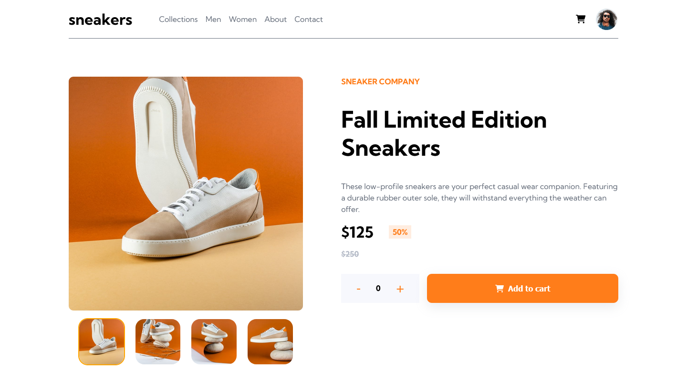
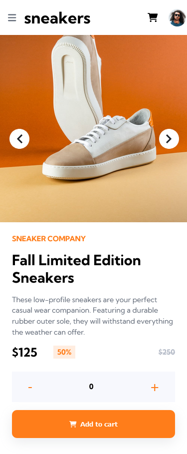

# Frontend Mentor - E-commerce product page solution

This is a solution to the [E-commerce product page challenge on Frontend Mentor](https://www.frontendmentor.io/challenges/ecommerce-product-page-UPsZ9MJp6). Frontend Mentor challenges help you improve your coding skills by building realistic projects.

## Table of contents

- [Overview](#overview)
  - [The challenge](#the-challenge)
  - [Screenshot](#screenshot)
  - [Links](#links)
- [My process](#my-process)
  - [Built with](#built-with)
  - [What I learned](#what-i-learned)
  - [Continued development](#continued-development)
  - [Useful resources](#useful-resources)
- [Author](#author)

**Note: Delete this note and update the table of contents based on what sections you keep.**

## Overview

### The challenge

Users should be able to:

- View the optimal layout for the site depending on their device's screen size
- See hover states for all interactive elements on the page
- Open a lightbox gallery by clicking on the large product image
- Switch the large product image by clicking on the small thumbnail images
- Add items to the cart
- View the cart and remove items from it

### Screenshot

Add a screenshot of your solution. The easiest way to do this is to use Firefox to view your project, right-click the page and select "Take a Screenshot". You can choose either a full-height screenshot or a cropped one based on how long the page is. If it's very long, it might be best to crop it.

Alternatively, you can use a tool like [FireShot](https://getfireshot.com/) to take the screenshot. FireShot has a free option, so you don't need to purchase it. 

Then crop/optimize/edit your image however you like, add it to your project, and update the file path in the image above.

### Links

- Solution URL: [Add solution URL here](https://your-solution-url.com)
- Live Site URL: [Add live site URL here](https://your-live-site-url.com)

## My process

### Built with

- Semantic HTML5 markup
- CSS custom properties
- Flexbox
- CSS Grid
- Desktop-first workflow
- [React](https://reactjs.org/) - JS library

### What I learned

Well, where to start? It was a big step forward for me since this was my first project using React after a bunch of theory. Everything was going pretty smooth until I got stuck on 'gallery' section or so. Tried a couple external libraries and couldn't make any of them work the way I expected (probably my fault) and decided to fry some brain mass doing the logic part, which in case wasn't a huge problem (now that I finished it). Got to put in practice some hooks and use the context API. It was satisfying to see working in the end tho.

### Continued development

I can see that there is a lot to work on. This could be solved in a bunch of ways and my solution, even working (the basic features at least), has a lot to improve. Looking forward to read/study more about using the localstorage, fetching data, authentication management, building SPA, diving into routes and using other helpful libraries. Also, there is a lot to improve and learn on HTML and even more on CSS, like support for browsers and accessibility.

### Useful resources

- [React Docs - hooks](https://reactjs.org/docs/hooks-reference.html#usecontext) - Even if I got scared at first (afraid of not getting the content clearly), the docs helped me a lot on... which is why they are there, right?

## Author

- Frontend Mentor - [@notFaceroll](https://www.frontendmentor.io/profile/notFaceroll)
